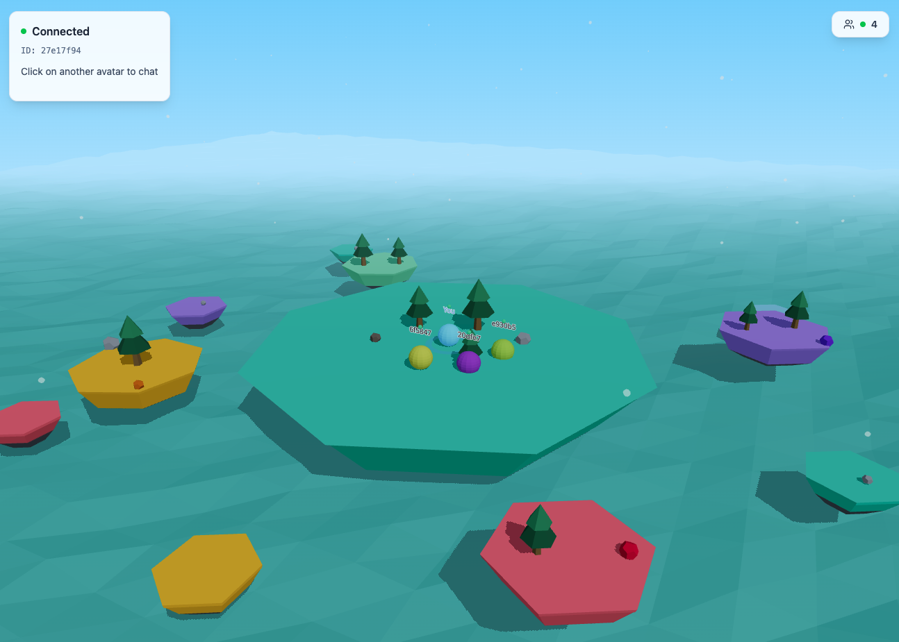

# P2P Chat (3D World + WebRTC)



A monorepo for a peer-to-peer chat application with:

- React + Vite + React Three Fiber frontend (3D island world)
- Cloudflare Workers + Durable Objects signaling backend
- WebRTC DataChannel for direct browser-to-browser messaging

## Architecture

### High-level flow

1. Client connects to the `World` Durable Object over WebSocket.
2. DO manages world presence (`spawn`, `user-joined`, `user-left`, availability).
3. User invites another user to chat (`chat-request` / `chat-response`).
4. DO relays WebRTC signaling messages (`rtc-offer`, `rtc-answer`, `rtc-ice-candidate`).
5. Peers establish direct WebRTC DataChannel and exchange messages P2P.

### Key design notes

- Presence state is stored in WebSocket attachments (hibernation-safe DO pattern).
- Users in active chat are marked unavailable, preventing additional invites.
- WebSocket stays open while in private chat to avoid reconnect race conditions.

## Repository layout

```text
apps/
	client/   # React + R3F + Tailwind UI
	server/   # Cloudflare Worker + Durable Object signaling
packages/
	types/    # Shared workspace types
```

## Tech stack

- Frontend: React 19, Vite 7, TypeScript, Tailwind CSS, Three.js, @react-three/fiber, @react-three/drei
- Backend: Cloudflare Workers, Durable Objects, Wrangler
- Realtime: WebSocket signaling + WebRTC DataChannel
- Package manager: pnpm workspaces

## Prerequisites

- Node.js 20+
- pnpm 10+
- Cloudflare account (for deployment)
- Wrangler CLI (installed via workspace dependencies)

## Environment configuration

Create `apps/client/.env.local`:

```bash
VITE_WORLD_WSS_URL=ws://localhost:8787
```

For deployed environments, use your public Worker URL (placeholder example):

```bash
VITE_WORLD_WSS_URL=https://<your-worker-domain>
```

Do not commit secrets or private endpoints.

## Local development

From repository root:

```bash
pnpm install
pnpm dev
```

This runs client and server in parallel using workspace scripts.

### Default local ports

- Client: `http://localhost:5173`
- Worker dev server: `http://localhost:8787`

## Scripts

### Root

- `pnpm dev` — run all apps in dev mode
- `pnpm build` — build client and run server type checks
- `pnpm deploy` — deploy server (Cloudflare Worker)
- `pnpm clean` — remove workspace dependencies/lockfile

### Client (`apps/client`)

- `pnpm --filter client dev`
- `pnpm --filter client build`
- `pnpm --filter client preview`
- `pnpm --filter client lint`

### Server (`apps/server`)

- `pnpm --filter server dev`
- `pnpm --filter server deploy`
- `pnpm --filter server types`

## Durable Object configuration

Server DO binding is configured in `apps/server/wrangler.toml`:

- Binding name: `WORLD`
- DO class: `World`
- Migration tag present for SQLite-backed DO class registration

If you change DO class names or bindings, update migrations and redeploy.

## Messaging protocol summary

### Presence / world

- `spawn`
- `world-state`
- `user-joined`
- `user-left`
- `set-available`
- `availability-changed`

### Invitation flow

- `chat-request`
- `chat-response`

### WebRTC signaling relay

- `rtc-offer`
- `rtc-answer`
- `rtc-ice-candidate`
